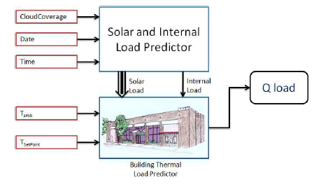

# 智慧建筑——空调智控项目实验及研究汇报

`深度增强学习` `时间序列预测分析` `大数据` `软硬件结合`

本次汇报的内容大纲：

> * 问题重述
> * 文献综述
> * 实验理论
> * 实验方法
> * 实验进程
> * 实验改进

 
 

## 问题重述

近几年，中国的国内生产总值的增长率维持在6%以上，但是能源的增长率只有3%～4%。这样的形势要求我们必须节能。建筑能源消耗在社会总能耗中的比例较大，发达国家的建筑用能一般占到全国总能耗的30%～40%\[1\]。
 

### 1.控制目标一：节能
暖通空调能耗是建筑能耗中的大户，据统计在发达国家中暖通空调能耗占建筑能耗的65%\[1\]，以建筑能耗占总能耗的35%计算，暖通空调能耗占总能耗的比例竟高达22.75%，由此可见建筑节能工作的重点应该是暖通空调的节能。

### 2. 控制目标二：舒适 
现代社会人们85%以上的时间是在室内度过的，相当一部分人每天要在人工环境中度过22～23h\[2\]。室内良好舒适的环境可以使人们精神愉快，提高工作效率，研究表明适宜的热环境可提高生产率达18%\[3\]
 

因此，在面对严峻的节能减排形势的同时，也不应过分地以人们的舒适感为代价，而应该在为室内人员提供舒适的生活、工作、学习环境的基础上实现能源的最大利用与节约。
 

综上，空调的智慧控制应建立了一种考虑热舒适度的空调节能方法，从而使用户感觉舒适的同时空调能源消耗花费最少。\[4\]。
 
 
 

## 文献综述

整个空调系统内部各环路和组件之间有着密切而复杂的联系, 因此需要优化控制系统不同的设定值或者运行模式来适应建筑负荷动态变化以及室外不断变化的天气情况。
 

然而,空调系统是一个典型的高度非线性、时变性、藕合性和不确定性的复杂多变量系统, 难以建立起准确的数学模型,因此也难以设计并实现有效的优化控制。
 

已有文献中，空调的智能控制模型主要有两大类，一类是基于建筑热动力模型，另一类是基于数据驱动的自适应模型

### 1.基于建筑热动态模型
**原理**：该类模型通过应用简化的建筑热动态模型来预测建筑温度变化。
 
**缺陷**: 该类模型模型难以同时保证控制的准确性和运算的高效性。
 

- 双线性系统模型，同时加入空调控制以外的其他供需进行协同调度  
T. Wei, Q. Zhu, and M. Maasoumy. Co-scheduling of HVAC control, EV charging and battery usage for building energy efficiency. ICCAD, 2014.  

 

本文基于天气参数、能源消耗构建建筑热动态模型。

- 双线性系统模型（以系统状态和天气参数为输入），将控制优化建模为序列线性规划问题  
F. Oldewurtel and et al. Energy efficient building climate control using stochastic model predictive control and weather predictions. ACC, 2010.

- 冷却系统的非线性模型，包括：冷却器、冷凝塔和热存储器  
Y. Ma and et al. Model predictive control for the operationof building cooling systems. IEEE Transactions on ControlSystems Technology, 20(3):796{803, 2012.  

 

 
本文是对校园的冷却系统负载进行预测，以调整冷却系统的输出参数适应负载变化，提升能源效率。

### 2. 基于数据驱动的模型
**原理**：采用实时数据作为输入，训练基于空调控制的增强学习模型。
 

- 采用表格式的Q值方程，该类方法不适用于状态空间大的问题。

（1）E. Barrett and S. Linder. Autonomous HVAC Control, A Reinforcement Learning Approach. Springer, 2015.
 

 

（2）B. Li and L. Xia. A multi-grid reinforcement learning method for energy conservation and comfort of HVAC in buildings. pages 444{449, 2015.
 
（3）D. Nikovski, J. Xu, and M. Nonaka. A method for computing optimal set-point schedules for HVAC systems. REHVA World Congress CLIMA, 2013.
 

 

- 采用神经拟合的增强学习方法，通过与室内人员的交互来决定最优的温度。该方法仅经过单区域建筑进行实验，其热转移过程由微分方程的简单形式建模。  
P. Fazenda and et al. Using reinforcement learning to optimize occupant comfort and energy usage in hvac systems. Journal of Ambient Intelligence and Smart Environments, pages 675-690, 2014.
 

- 采用随机森林算法逼近动作值，用来进行简单的开/关决策  
G. T. Costanzo and et al. Experimental analysis of data-driven control for a building heating system. CoRR, abs/1507.03638, 2015.
 

- 采用深度增强学习，预测控制空调控制输出  
Tianshu Wei and et al. Deep Reinforcement Learning for Building HVAC Control  
Conference: the 54th Annual Design Automation Conference 2017

 
 
 

## 实验理论

### 1.基于MDP的建模
MDP（Markov Decision Process）顾名思义，是俄国数学家马尔可夫提出的一类随机过程。可以说，MDP是增强学习建模的理论基石，几乎所有增强学习的问题首先都要通过MDP来描述。

- 时序非依赖
MDP有一个关键的属性，即t时刻的State只由t-1时刻的State决定，而不依赖于t-1时刻之前的时序 。也可以理解为，State包含了所有历史相关信息。

- 状态转移矩阵
首先要明确状态转移概率的概念：从一个马尔科夫状态跳转到后继状态的概率。

- episode
增强学习中，从初试状态 s_{1} 到终止状态的序列过程，称为一个episode。通常，终止状态有两种：1. 时间终止；2. 状态终止。（终止状态等价于自身转移概率为1，reward为0的状态。）

- reward与Return
t时序的reward（用Rt表示）是对MDP中单个状态 s_{t} 的评价；return（用Gt表示）是对MDP中单个episode（从t+1到终止状态）在t时序的评价。

### 2.Value of State（v(s)）
- v(s)的定义
的定义.png)
 

- Bellman方程

 

### 3.Q-Value
- Q-table
Q-learning中存在一个Q-table，用来存储state和action对应的Q值，Q值反映的是环境的回报，Q-table会往回报高的方向进行更新。Q-table如下图：

 

当state、action维度增大时。Q-table的维度会变得特别的大，难以维护，查找的时间消耗也会变得特别的大。

- DQN
创新点在于用神经网络做一个非线性函数，用来拟合state、action和Q值之间的关系。并且提出了experience replay来降低数据之间的关联性。 
 

experience replay 的具体做法是经历一个state的时候把state、对应的action、reward存到一个固定长度buffer里面，后面在进行训练更新网络的时候，输入的数据就是从buffer里面随机选择的。 

 

DQN同时也存在一个问题，在于它的Loss。它的Loss是通过同一个网络产生Q-target和Q-eval的差作为Loss的，两者同时变，网络收敛比较困难。 
r(t)是在状态s(t)下执行action获得的reward（和s(t)无关），所以写成r(t)。整个Loss的解释就是当前状态s(t)下的Q值需要往“执行当前action获得的reward + 下一个状态可能获得的最大的Q值”的方向变化。
 

后来Nature的DQN为了解决收敛问题，提出使用一个延迟网络target network用来计算下一个状态可能获得的最大的Q值。 

 
 
 

## 实验方法

###  算法流程

 

## 实验进程
- **项目进程**

 

- **数据交互**
    - 现状：采集设备、数据库、算法程序之间的交互已打通

- **室外预测**
    - 现状：已稳定运行
    - 算法对比
    
    
     
        - ARIMA模型
        用ARIMA对室外温度序列进行自回归，选取滞后阶数为5
        - BPNN
            - 拓扑结构
                - 层数：3层
                - 神经元数：4-5-2
                - 藏层神经元函数：sigmoid函数
                - 训练样本数量：12800
                - 测试样本数量：3200
        - SVR（RBF）
            -  拓扑结构
                - 层数：3层
                - 神经元数：4-X-2
                - 隐藏层kernal：高斯核
                - 训练样本数量：1000
                - 测试样本数量：3200
                - 原理：RBF Network                 通常只有三层。输入层、中间层计算输入 x 矢量与样本矢量 c 欧式距离的 Radial Basis Function (RBF) 的值，输出层算它们的线性组合。

- **室内控制**
    - 现状：调试目标和参数
    - 控制目标和时间间隔参数对比

| 目标        | 温度   |  电量消耗  | PMV
| --------   | -----:  | :----:  | ----
| 是否反映热舒适度     | 是 |   否     |是
| 是否反映能耗     |   否   |   是   |否
| 是否人为设定       |    是    |  否  |否
 

| 控制时间间隔        | 5min   |  10min  | 15min
| --------   | -----:  | :----:  | ----
| 收敛周期     | 15天 |   30天     | 45天
| 泛化能力     |   弱   |   较强   |强
| 控制输出时滞性       |     强  |  较弱  |弱

### 实验改进
- **控制目标多元化**
    - 温度目标优化为PMV（热舒适度指标）
        舒适控制理念在预测控制的体现：受控量不仅是影响热舒适度的空气温度、相对湿度和气流速度，最终的受控量是 PMV指标。
    - 加入电量消耗目标
- **多区域控制**
    - 同时在多个房间进行预测控制

 
 
 
2018 年 12月 21日    

## 参考文献

\[1\]: 建筑网.建筑环境与暖通空调能耗
 
\[2\]:彦启森.  空调与人居环境[J].  暖通空调, 2003, 33 (5): 1-5. 
 
\[3\]:William J.Fisk, P.E. How IEQ Affects Health, Productivity. ASHRAE Journal, 2002, 5.
 
\[4\]: 桑乃云.考虑舒适度的空调节能方法研究[J].节能,2018,37(10):40-43.
 

---

